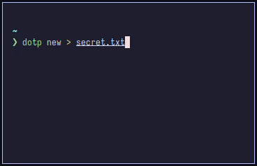

[](https://github.com/petlack/dotp/actions/workflows/tests.yml)
[](https://github.com/petlack/dotp/actions/workflows/compile.yml)

[](https://github.com/petlack/dotp/actions/workflows/archlinux.yml)
[](https://github.com/petlack/dotp/actions/workflows/alpine.yml)
[](https://github.com/petlack/dotp/actions/workflows/debian.yml)
[](https://github.com/petlack/dotp/actions/workflows/rpm.yml)

# dotp

:key: Command-line tool for managing Time-based One-Time Passwords (TOTPs).



<!--toc:start-->
- [Usage](#usage)
  - [Generate a new secret](#generate-a-new-secret)
  - [Get current TOTP code](#get-current-totp-code)
  - [Watch current TOTP code](#watch-current-totp-code)
  - [Validate TOTP code](#validate-totp-code)
  - [`secret_options`](#secret_options)
- [Examples](#examples)
  - [Secret stored in environment variable](#secret-stored-in-environment-variable)
  - [Secret stored in file](#secret-stored-in-file)
  - [Pass secret as an argument](#pass-secret-as-an-argument)
  - [Usage with `pass`](#usage-with-pass)
  - [Integration with `qrencode`](#integration-with-qrencode)
- [Installation](#installation)
  - [Alpine](#alpine)
  - [Arch Linux](#arch-linux)
  - [Fedora/openSUSE](#fedoraopensuse)
  - [Ubuntu/Debian](#ubuntudebian)
  - [Other](#other)
<!--toc:end-->

## Usage

### Generate a new secret
To generate a new TOTP secret, the following command will generate one and print it to standard output:
```bash
dotp new
```

### Get current TOTP code
Retrieve the current TOTP code using the secret options described below:
```bash
dotp get [secret_options]
```

### Watch current TOTP code
Watch the current TOTP code in the terminal using the command
```bash
dotp watch [secret_options]
```

### Validate TOTP code
Validate a TOTP code using the secret options:
```bash
dotp validate [secret_options] 001122
```

### `secret_options`
These options describe the source of the secret and can be one of
| Name | Description |
| --------------- | --------------- |
| `--secret-env ENV_NAME` | Name of the environment variable holding the secret |
| `--secret-file /path/to/file` | Path to the file containing the secret |
| `--secret-stdin` | Read secret from stdin |
| `--secret-unsafe-value mysecret` | Use the secret provided as an argument |

## Examples

### Secret stored in environment variable
Set an environment variable `TOTP_SECRET` and use it to get the TOTP code:
```bash
export TOTP_SECRET="mysecret"
dotp get --secret-env TOTP_SECRET
```

### Secret stored in file
Store your secret in a file and retrieve the TOTP code:
```bash
echo "mysecret" > ./secret.plaintext
dotp get --secret-file ./secret.plaintext
```

### Pass secret as an argument
Directly provide the secret as an argument (not recommended for production use):
```bash
dotp get --secret-unsafe-value "mysecret"
```

### Usage with `pass`

To generate a new secret key and store it in password store, run
```bash
dotp new | pass insert -e "TOTP/foo"
```

To get a current TOTP code, run
```bash
pass show "TOTP/foo" | dotp get --secret-stdin
```

To validate a TOTP code, run
```bash
pass show "TOTP/foo" | dotp validate --secret-stdin "000111"
```

### Integration with `qrencode`
To add the TOTP secret to a mobile app, you can use [qrencode](https://github.com/fukuchi/libqrencode) to generate and display the QR code.
```bash
pass show 'TOTP/mykey' |
    dotp uri --account foo@bar --issuer myapp --secret-stdin |
    qrencode -t ANSI
```

## Installation

### Alpine
Head to the [Releases](https://github.com/petlack/dotp/releases) section and download the latest apk package and public key.
```bash
wget https://github.com/petlack/dotp/releases/download/v0.0.1.20240713.01/dotp-0.0.1.20240713.01-r1.apk
wget https://github.com/petlack/dotp/releases/download/v0.0.1.20240713.01/dotp-0.0.1.20240713.01-r1.apk.rsa.pub
cp dotp-0.0.1.20240713.01-r1.apk.rsa.pub /etc/apk/keys/
apk add dotp-0.0.1.20240713.01-r1.apk
```

### Arch Linux
**Install from AUR**
```bash
yay -S dotp-git
```

**Build package from source**
```bash
git clone https://github.com/petlack/dotp && cd dotp || return
tar -czf archlinux/pkgbuild-src/dotp-0.0.1.20240713.01.tar.gz \
    *.go go.mod version.txt
makepkg --dir archlinux/pkgbuild-src --noconfirm
sudo pacman -U ./archlinux/pkgbuild-src/dotp-0.0.1.20240713.01-1-x86_64.pkg.tar.zst
```

**Install from release**

Head to the [Releases](https://github.com/petlack/dotp/releases) section and download the latest Arch Linux package.
```bash
wget https://github.com/petlack/dotp/releases/download/v0.0.1.20240713.01/dotp-0.0.1.20240713.01-1-x86_64.pkg.tar.zst
sudo pacman -U ./dotp-0.0.1.20240713.01-1-x86_64.pkg.tar.zst
```

### Fedora/openSUSE
Head to the [Releases](https://github.com/petlack/dotp/releases) section and download the latest **rpm** package.
```bash
wget https://github.com/petlack/dotp/releases/download/v0.0.1.20240713.01/dotp_0.0.1.20240713.01.fc41.x86_64.rpm
sudo dnf install -y dotp_0.0.1.20240713.01-1.fc41.x86_64.rpm
```

### Ubuntu/Debian
Head to the [Releases](https://github.com/petlack/dotp/releases) section and download the latest **deb** package.
```bash
wget https://github.com/petlack/dotp/releases/download/v0.0.1.20240713.01/dotp_0.0.1.20240713.01-1_amd64.deb
sudo dpkg -i dotp_0.0.1.20240713.01-1_amd64.deb
```

### Other
**Build from source**

Make sure you have [Go 1.22 installed](https://go.dev/doc/install)
```bash
git clone https://github.com/petlack/dotp && cd dotp || return
go build .
install -m 755 dotp /usr/local/bin/dotp
```

**Install release binary**

Head to the [Releases](https://github.com/petlack/dotp/releases) section and download the latest binary for your architecture.
Example:
```bash
wget https://github.com/petlack/dotp/releases/download/v0.0.1.20240713.01/dotp-linux-amd64
install -m 755 dotp-linux-amd64 /usr/local/bin/dotp
```
